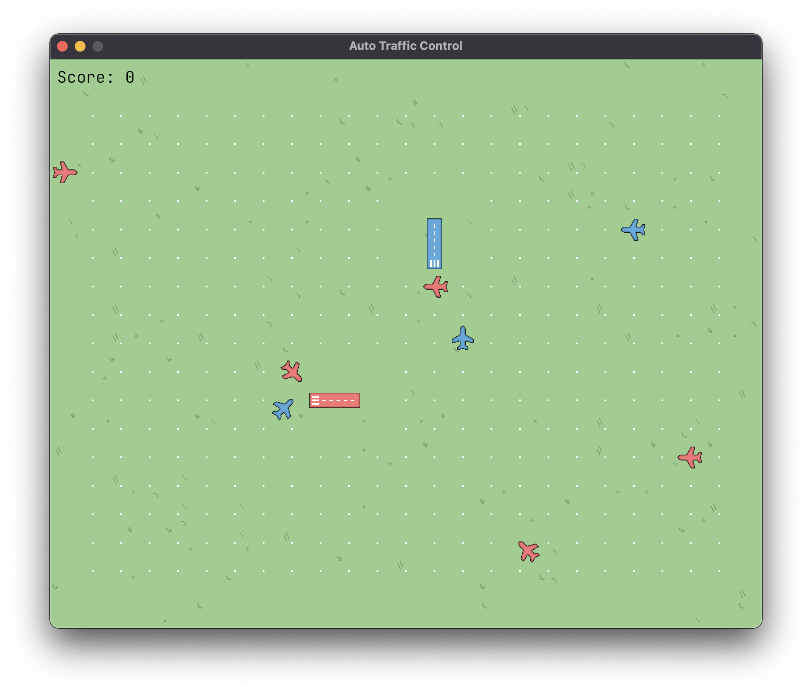

# 🛬 Auto Traffic Control

[Homepage](https://auto-traffic-control.com) |
[Documentation](https://auto-traffic-control.com/docs) |
[Community](https://github.com/jdno/auto-traffic-control/discussions)

**Auto Traffic Control** is a video game played by programming. The player's
task is to create a program that can safely manage the airspace above two
airports.

The game is designed to provide an open-ended sandbox that players can use to
freely practice programming. It provides a language-agnostic [gRPC] API, giving
players free choice of programming language or paradigm.

Check out the official [Getting Started](https://auto-traffic-control.com/docs)
guide to start playing the game.

## Project Status

The project is currently on hold, and I am not sure when or if I will be able to
work on it again.

If you are interested in building a similar game, feel free to get in touch to
discuss the project. I would be happy to share my experience and help you get
started with your own game. 🙂

## License

Licensed under either of

- Apache License, Version 2.0 ([LICENSE-APACHE](LICENSE-APACHE) or <http://www.apache.org/licenses/LICENSE-2.0>)
- MIT license ([LICENSE-MIT](LICENSE-MIT) or <http://opensource.org/licenses/MIT>)

at your option.

## Contribution

Unless you explicitly state otherwise, any contribution intentionally submitted
for inclusion in the work by you, as defined in the Apache-2.0 license, shall be
dual licensed as above, without any additional terms or conditions.

[grpc]: https://grpc.io/
